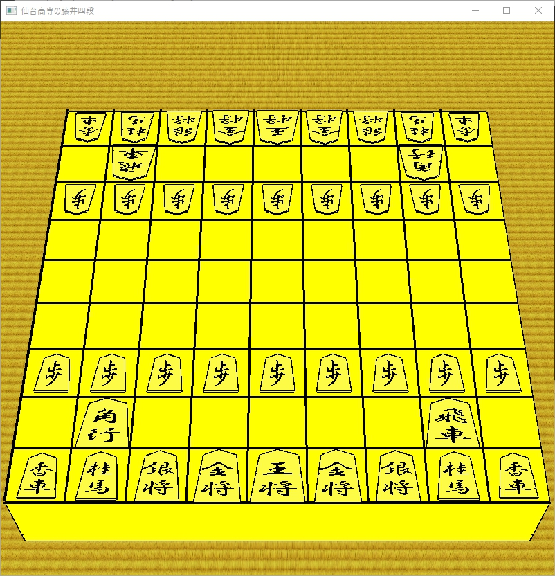

# shougi-no-model(OpenGL)

~これはだれかの実習課題だったりする。。。?~

> 使用音源  
> [http://shw.in/sozai/japan.php](http://shw.in/sozai/japan.php)  
> よみ2 
> 4：53	slow 和風汎用BGM　琴・尺八・三味線  
> 和風・ダーク・暗い  
> 0：49程度のフレーズを繰り返します	2012年4月  